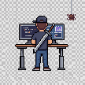

<table>
<tr>
<td valign="top" width="55%">

## Peter Kaleta
**Builder & Engineering Leader**

15+ years of building solutions and scaling teams across web, mobile and crypto.

</td>
<td valign="top" width="45%">

</td>
</tr>
</table>

### Code

### Architecture

### Web3

### Team Topologies

---

